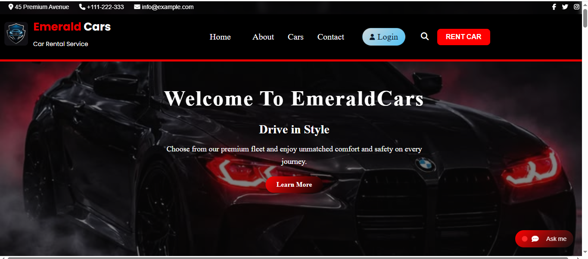
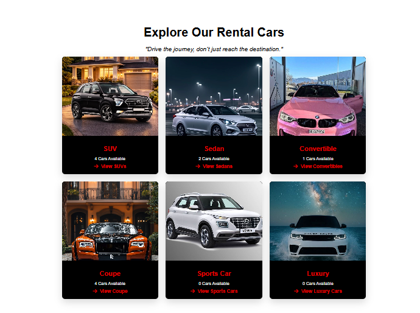
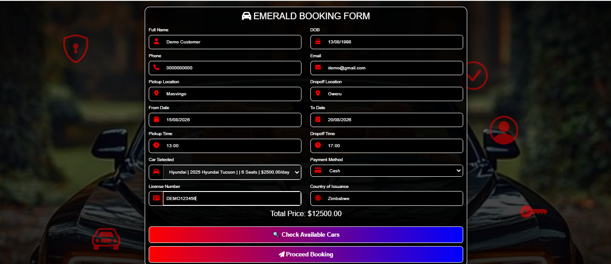
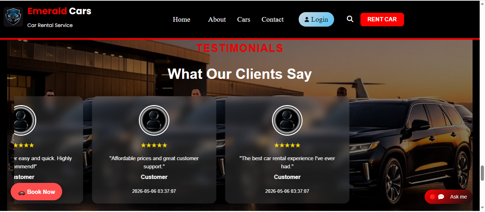
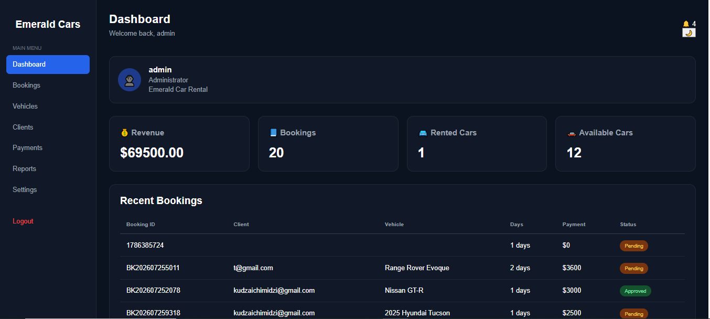

# Emerald Car Rental

A full-stack car rental management system developed using PHP, MySQL, HTML, CSS and JavaScript.

## About the Project

Emerald Car Rental is a web-based car rental platform designed to make vehicle rental management easier for both customers and administrators.

Customers can browse available vehicles, view vehicle details, create accounts, make bookings and manage their rental information.

Administrators can manage vehicles, brands, bookings, customers and other aspects of the rental system through an administrative dashboard.

## Features

### Customer Features

- User registration and login
- User profile management
- Browse available vehicles
- View vehicle details
- Check vehicle availability
- Online vehicle booking
- Booking confirmation
- Booking history
- Receipt generation
- PDF receipt generation
- Email notifications
- Customer testimonials

### Administrator Features

- Admin authentication
- Admin dashboard
- Vehicle management
- Add, edit and delete vehicles
- Vehicle brand management
- Booking management
- Customer management
- Payment management
- Subscriber management
- Testimonials management
- Reports
- Booking details
- Vehicle availability management

## Technologies Used

- PHP
- MySQL
- HTML5
- CSS3
- JavaScript
- AJAX
- PHPMailer
- FPDF
- PHP QR Code
- XAMPP

## Project Structure

emeraldcarrental/
│
├── admin/              # Administrator panel
├── cars/               # Vehicle images
├── categories/         # Vehicle categories
├── css/                # Stylesheets
├── fpdf/               # PDF generation
├── home/               # Homepage files
├── includes/           # Shared PHP files
├── js/                 # JavaScript files
├── PHPMailer/          # Email functionality
├── phpqrcode/          # QR code generation
├── users/              # Customer functionality
├── index.php           # Main entry point
├── login.php           # User login
├── signup.php          # User registration
└── contact.php         # Contact page

Database

The application uses MySQL to store information including:

Users
Vehicles
Vehicle brands
Bookings
Payments
Testimonials
Subscribers
Installation
Requirements
XAMPP
Apache
MySQL
PHP
Web browser

Setup
Clone or download the repository.
Place the project inside the XAMPP htdocs directory.
Start Apache and MySQL from XAMPP.
Create the required MySQL database.
Import the project database.
Configure the database connection.
Open the application in a browser.

Example:

http://localhost/emeraldcarrental
Project Status

Completed and available for demonstration.

Author

Kudzai Chimidzi

BCA Student | Aspiring AI & Software Developer

## Screenshots

### Homepage

### Rental Cars

### Booking System

### Customer Testimonials

### Admin Dashboard

License

This project was developed for educational and portfolio purposes.
